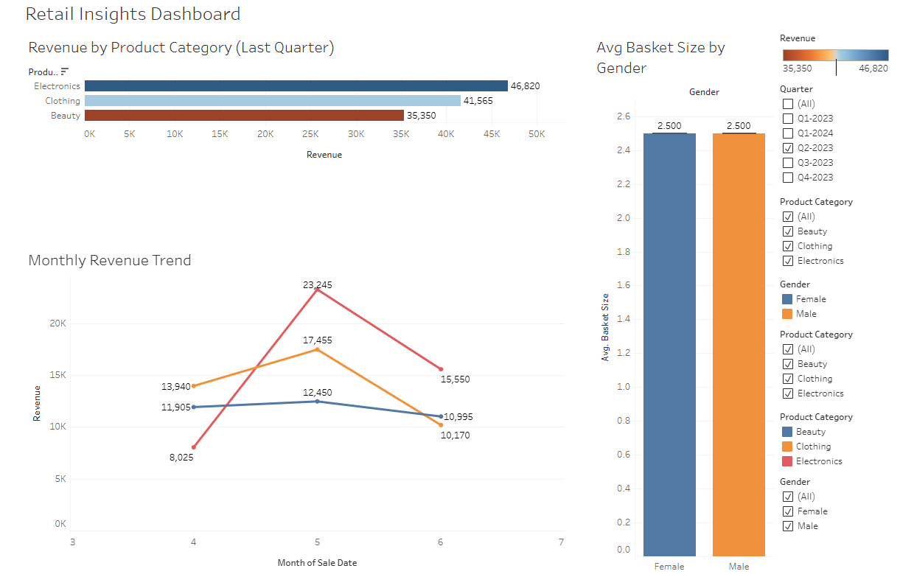

# 🛍️ Retail Sales Insights Dashboard

### Uncovering customer trends, product performance, and revenue drivers using SQL and Tableau.

This project analyzes transactional retail data to identify which products sell best, how customer segments behave, and what store-level actions can drive more revenue. The dashboard and recommendations support multiple departments — from marketing and finance to inventory and operations.

---

## 🧾 Executive Summary

This dashboard answers three high-impact business questions:

1. **Which customer segments contribute most to revenue?**
2. **How does the timing or frequency of purchases affect revenue generation?**
3. **If we could only stock or promote a limited range of products, which ones should be prioritized?**

### 📊 Dashboard Overview

The dashboard includes:
- Segment-based revenue breakdown by gender, city, and customer type
- Analysis of revenue by day of week and hour of day
- A prioritized product list by total revenue and average unit price

> 🔗 [View the live dashboard on Tableau Public](https://public.tableau.com/views/RetailPerformanceDashboardSalesTrendsCustomerBehaviorAnalysis/RetailInsightsDashboard?:language=en-US&:sid=&:redirect=auth&:display_count=n&:origin=viz_share_link) 



---

### ✅ Actionable Recommendations

- **📣 Marketing Insight:* These segments contribute disproportionately to total revenue — targeted offers could increase lifetime value.**
  - *Target loyal and female customers with high-value promotions.

- **🛒 Operations Insight:* Helps align labor with traffic spikes and optimize customer service.**
  - *Focus staffing and promotions during peak hours (1–3 PM) and weekends.

- **📦 Inventory Insight:* Helps plan restocks and warehouse space around top-selling goodsEmphasize high-revenue product categories like "Food and beverages" and "Fashion accessories".**
- **💰 Finance Insight:* Focus financial projections on top-contributing product lines.**
  - *Emphasize high-revenue product categories like "Food and beverages" and "Fashion accessories".

- **🧠 Strategy Insight:* Products with high price but low total revenue may need better positioning or bundling.**
  - *Use price-per-unit trends to identify margin opportunities in underperforming categories.

---

## 🔍 Deep Dive: Analytical Approach

### 🧮 Dataset Overview

- Retail sales data from multiple store locations
- Includes `Invoice ID`, `Product Line`, `Customer Type`, `Gender`, `City`, `Payment Method`, `Date`, `Time`, `Quantity`, `Unit Price`, and `Total`

### 💾 SQL-Based Analysis

- Used MySQL to compute:
  - Total and average revenue per customer segment
  - Peak time patterns by extracting hour/day from timestamps
  - Product-level performance metrics

- Created clean calculated fields like `Revenue`, `PricePerUnit`, and extracted dimensions like `Hour` and `Weekday`

### 📊 Tableau Visualizations

- **Bar charts** for customer and product segment comparisons
- **Heatmaps** for purchase timing trends
- **Treemaps** and **ranked lists** for product prioritization

---

## 🔗 Data Source

This dataset is publicly available from Gigasheet’s sample data gallery:  
[Retail Sales Dataset – Gigasheet](https://www.gigasheet.com/sample-data/retail-sales-dataset?utm_source=chatgpt.com)

---

## 🛠️ Tools Used

- **SQL (MySQL dialect):** For transformation, aggregation, and segmentation
- **Tableau Public:** For dashboard creation and storytelling
- **Python (Pandas):** For light preprocessing and CSV cleaning

---

## 📁 Repository Structure

```
retail-insights-project/
│
├── data/
│   └── retail_sales_cleaned.csv
│
├── sql/
│   ├── retail_table_setup.sql
│   ├── q1_segment_revenue.sql
│   ├── q2_timing_patterns.sql
│   └── q3_top_products.sql
│
├── images/
│   └── dashboard_preview.png
│
├── LICENSE
├── README.md
```

---

## 👋 About the Analyst

**Jeremy Gutierrez**  
Aspiring Data Analyst focused on actionable insights and stakeholder communication.  
Let’s connect: [LinkedIn](https://www.linkedin.com/in/jeremy-gutierrez-4502391bb/) | [GitHub](https://github.com/JZambrana1612) 
